# Distributed Vector Processing using MPI

<p align="center">
  
  
  
  
  
</p>

<p align="center">
  <b>A practical MPI experiment demonstrating workload distribution, local computation, reduction, correctness verification, and performance analysis for large-vector processing.</b>
</p>

---

## Table of Contents

- [Project Overview](#project-overview)
- [Problem Statement](#problem-statement)
- [Objectives](#objectives)
- [Key Concepts Demonstrated](#key-concepts-demonstrated)
- [Technology Stack](#technology-stack)
- [System Architecture](#system-architecture)
- [Processing Methodology](#processing-methodology)
- [MPI Program Flow](#mpi-program-flow)
- [Sequential Implementation](#sequential-implementation)
- [MPI Implementation](#mpi-implementation)
- [Experimental Setup](#experimental-setup)
- [Performance Results](#performance-results)
- [Speedup and Parallel Efficiency](#speedup-and-parallel-efficiency)
- [Why More Processes Were Slower](#why-more-processes-were-slower)
- [Work Distribution](#work-distribution)
- [Correctness Verification](#correctness-verification)
- [Performance Graphs](#performance-graphs)
- [Important Execution Screenshots](#important-execution-screenshots)
- [Detailed Screenshot Evidence](#detailed-screenshot-evidence)
- [Project Structure](#project-structure)
- [How to Build and Run](#how-to-build-and-run)
- [Reproducibility Procedure](#reproducibility-procedure)
- [Results Interpretation](#results-interpretation)
- [Limitations](#limitations)
- [Future Improvements](#future-improvements)
- [Learning Outcomes](#learning-outcomes)
- [Conclusion](#conclusion)
- [Author / Team](#author--team)

---

## Project Overview

**Distributed Vector Processing using MPI** is a parallel-computing project implemented in **C using the Message Passing Interface (MPI)**.

The experiment demonstrates how a large vector can be divided into independent chunks and processed by multiple MPI processes. Each process receives a portion of the vector, performs a local computation, and contributes its partial result to a final global result using `MPI_Reduce()`.

The project also contains a sequential implementation so that the team can compare:

- execution on a single process,
- MPI execution with 2 processes,
- MPI execution with 3 processes, and
- MPI execution with 4 processes.

The purpose is not simply to show that parallel execution is possible. The experiment also investigates an important practical principle of parallel computing:

> **Increasing the number of processes does not automatically make a program faster.**

For relatively small workloads running inside a single virtual machine, MPI communication, process creation, synchronization, memory movement, and reduction overhead can be greater than the time saved by dividing the computation.

---

## Problem Statement

Processing a large vector sequentially requires a single execution context to handle the complete workload. The objective of this project is to investigate how the same workload can be distributed across multiple processes using MPI and how that distribution affects execution time.

### Problem Definition

> **Design and implement a distributed vector-processing application using MPI in C, where a large vector is divided among multiple processes, each process independently computes a local sum, and the local results are combined into a final global sum. Compare the distributed implementation with a sequential implementation and analyze the effect of process count on performance.**

---

## Objectives

The project is designed to achieve the following objectives:

1. Understand the basic architecture of MPI-based parallel programs.
2. Initialize and terminate an MPI environment using `MPI_Init()` and `MPI_Finalize()`.
3. Identify individual processes using `MPI_Comm_rank()`.
4. Determine the total number of participating processes using `MPI_Comm_size()`.
5. Divide a large vector into smaller workloads.
6. Distribute vector segments among MPI processes using `MPI_Scatter()`.
7. Perform local computation independently on each process.
8. Aggregate local results using `MPI_Reduce()`.
9. Verify that sequential and distributed executions produce the same result.
10. Measure execution time and compare different process configurations.
11. Calculate speedup and parallel efficiency.
12. Explain why communication and process overhead can reduce performance for small workloads.

---

## Key Concepts Demonstrated

| Concept | Demonstration in this Project |
|---|---|
| Process creation | MPI launches multiple independent processes |
| Process identification | `MPI_Comm_rank()` |
| Process count | `MPI_Comm_size()` |
| Data distribution | `MPI_Scatter()` |
| Local computation | Each process sums its assigned vector segment |
| Global aggregation | `MPI_Reduce()` with a sum operation |
| Synchronization / coordination | MPI collective operations |
| Performance measurement | Sequential and MPI execution times |
| Correctness verification | Matching global sum |
| Scalability analysis | Comparison across process counts |
| Parallel efficiency | Speedup divided by process count |

---

## Technology Stack

| Component | Technology / Version |
|---|---|
| Programming Language | C |
| Parallel Programming Model | MPI |
| MPI Implementation | Open MPI 4.1.6 |
| C Compiler | GCC 13.3.0 |
| Operating System | Ubuntu 24.04 |
| Virtualization | VMware Workstation |
| MPI Compiler Wrapper | `mpicc` |
| MPI Launcher | `mpirun` |
| Repository | GitHub |

### MPI vs Open MPI

MPI is the **standard/API/programming model** used by the application. **Open MPI** is an implementation of that standard that supplies tools such as `mpicc` and `mpirun`.

Therefore, this remains an **MPI project implemented using Open MPI**.

---

## System Architecture

```text
                         LARGE VECTOR
                              |
                              v
                    +---------------------+
                    |     MPI Process 0   |
                    | Distribution / Root |
                    +----------+----------+
                               |
                          MPI_Scatter
                               |
          +--------------------+--------------------+
          |                    |                    |
          v                    v                    v
   +-------------+      +-------------+      +-------------+
   |   Process 0 |      |   Process 1 |      |   Process 2 |  ... Process N
   | Vector Chunk|      | Vector Chunk|      | Vector Chunk|
   | Local Sum   |      | Local Sum   |      | Local Sum   |
   +------+------+      +------+------+      +------+------+
          \                    |                    /
           \___________________|___________________/
                               |
                          MPI_Reduce
                               |
                               v
                    +---------------------+
                    |     Global Sum      |
                    |    Process 0        |
                    +---------------------+
```

The architecture separates the application into two logical stages:

**Stage 1 — Distribution:** the vector workload is divided and delivered to participating processes.

**Stage 2 — Aggregation:** each process calculates its partial result and the partial results are combined into one final answer.

---

## Processing Methodology

The vector used for the demonstrated experiment contains:

```text
Vector size = 1,000,000 elements
```

The test vector contains the values from `1` through `1,000,000`.

The expected sum is:

```text
1 + 2 + 3 + ... + 1,000,000 = 500000500000
```

This known value provides a simple and reliable way to verify correctness.

### Sequential Approach

The sequential program performs the entire calculation in one execution context:

```text
Vector
  |
  v
Single process
  |
  v
Sum all 1,000,000 elements
  |
  v
Final result
```

### MPI Approach

The MPI program divides the workload among processes:

```text
1,000,000 elements
        |
        +------------------------------+
        |                              |
   2 processes                     4 processes
        |                              |
  500,000 each                   250,000 each
        |                              |
 Local computation               Local computation
        |                              |
        +-----------+------------------+
                    |
               MPI_Reduce
                    |
                    v
              Global result
```

---

## MPI Program Flow

The main MPI implementation follows this execution sequence:

1. **`MPI_Init()`**
   - Starts the MPI runtime environment.

2. **`MPI_Comm_rank()`**
   - Determines the rank/ID of the current process.
   - Rank `0` is normally treated as the root process.

3. **`MPI_Comm_size()`**
   - Determines how many MPI processes are participating.

4. **Vector creation**
   - The root process prepares the large input vector.

5. **Work partitioning**
   - The vector is divided into equal-size chunks for the tested process counts.

6. **`MPI_Scatter()`**
   - Each process receives its assigned portion.

7. **Local computation**
   - Each process calculates the sum of its local chunk.

8. **`MPI_Reduce()`**
   - Local sums are combined using the `MPI_SUM` reduction operation.

9. **Result validation**
   - Rank `0` prints the global sum.

10. **Timing**
    - The elapsed time is measured to compare sequential and parallel configurations.

11. **`MPI_Finalize()`**
    - Closes the MPI environment cleanly.

---

## Sequential Implementation

The sequential program processes all **1,000,000 elements** using one process.

### Measured Runs

| Run | Execution Time (s) |
|---:|---:|
| 1 | 0.002510 |
| 2 | 0.002068 |
| 3 | 0.001601 |
| 4 | 0.001694 |
| **Average** | **0.001968** |

### Correctness Output

```text
Vector Size : 1000000
Total Sum   : 500000500000
```

### Sequential Execution Evidence

<p align="center">
  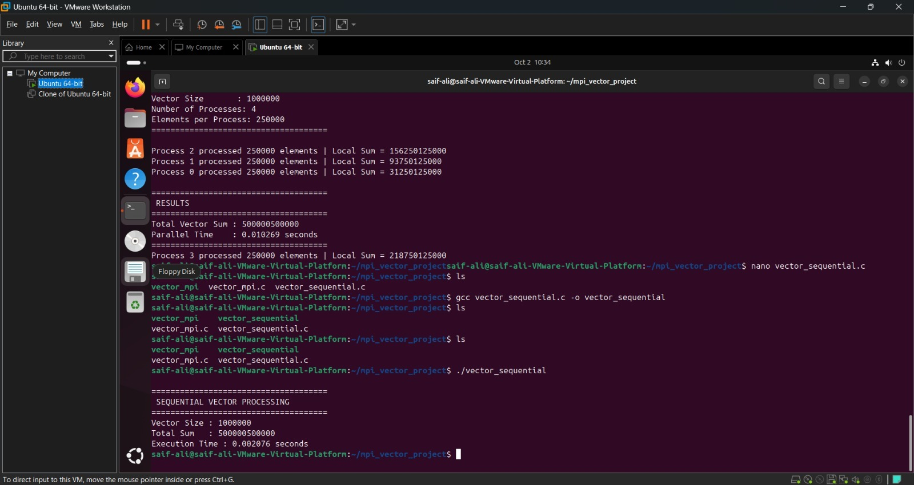
</p>

*Figure 1 — Sequential execution of the vector-processing program.*

---

## MPI Implementation

### 2-Process Execution

For the 2-process configuration:

```text
Vector Size         : 1000000
Number of Processes : 2
Elements per Process: 500000
Total Vector Sum    : 500000500000
Parallel Time       : 0.002783 seconds
```

Each participating process handles approximately **500,000 elements**.

<p align="center">
  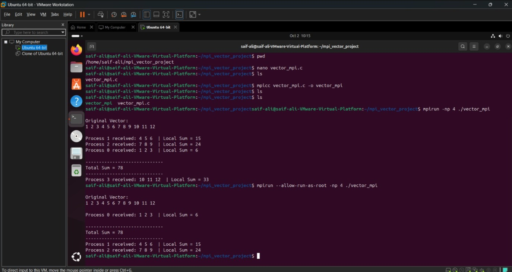
</p>

*Figure 2 — MPI execution using 2 processes.*

### 3-Process Execution

The project also includes a 3-process execution screenshot as additional evidence that the application can be launched with an intermediate process count.

<p align="center">
  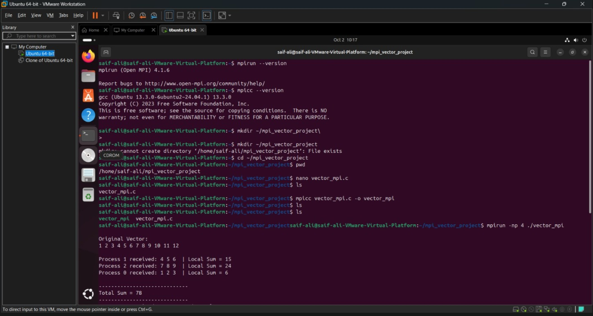
</p>

*Figure 3 — MPI execution using 3 processes.*

### 4-Process Execution

For the 4-process configuration:

```text
Vector Size         : 1000000
Number of Processes : 4
Elements per Process: 250000
Total Vector Sum    : 500000500000
Parallel Time       : 0.003888 seconds
```

Each participating process handles approximately **250,000 elements**.

<p align="center">
  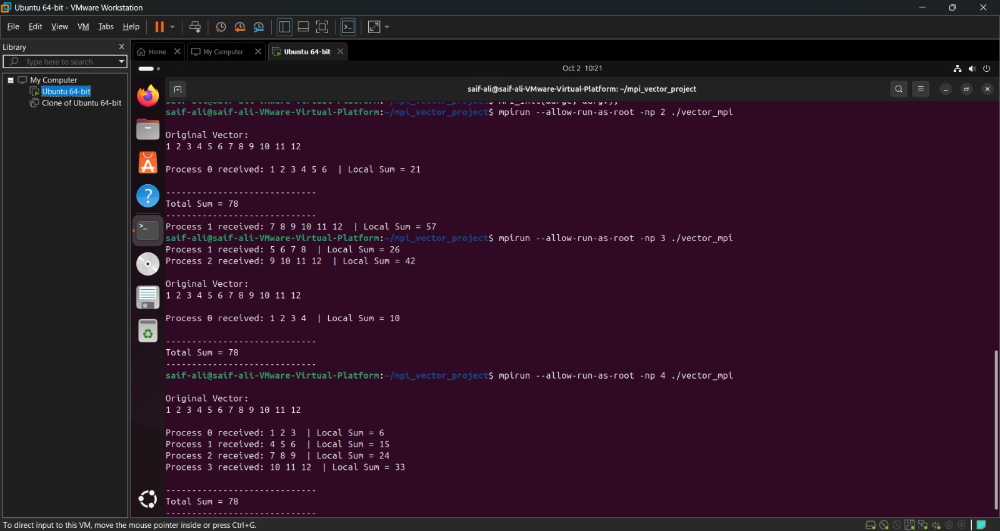
</p>

*Figure 4 — MPI execution using 4 processes.*

---

## Experimental Setup

The documented experiment was performed using the following environment:

| Parameter | Configuration |
|---|---|
| OS | Ubuntu 24.04 |
| Execution environment | VMware Workstation virtual machine |
| MPI implementation | Open MPI 4.1.6 |
| C compiler | GCC 13.3.0 |
| Dataset size | 1,000,000 elements |
| Sequential processes | 1 |
| Parallel configurations | 2, 3 and 4 processes |
| Aggregation operation | `MPI_SUM` |
| Primary result | Total vector sum |

> **Experimental note:** The recorded timings represent the configured VMware/Ubuntu environment and should be treated as experimental observations rather than universal performance benchmarks. CPU allocation, virtualization overhead, operating-system load, compiler optimization level, memory subsystem, and MPI configuration can all change the measured results.

---

## Performance Results

### Recorded Execution Times

The values below are the documented measurements used for the performance analysis.

| Configuration | Processes | Work per Process | Execution Time (s) |
|---|---:|---:|---:|
| Sequential | 1 | 1,000,000 | **0.001968** average |
| MPI | 2 | 500,000 | **0.002783** |
| MPI | 4 | 250,000 | **0.003888** |

### Performance Interpretation

The measured execution time increased as the number of MPI processes increased:

```text
Sequential : 0.001968 s
2 MPI      : 0.002783 s
4 MPI      : 0.003888 s
```

For this specific test, the sequential implementation is the fastest of the measured configurations.

This does **not** indicate that MPI is ineffective. Instead, it demonstrates that parallel-performance gains depend on workload size and the ratio between useful computation and parallelization overhead.

---

## Speedup and Parallel Efficiency

### Speedup Formula

Speedup is defined as:

```text
Speedup = Sequential Time / Parallel Time
```

### 2-Process Speedup

```text
Sequential average = 0.001968 s
2-process time     = 0.002783 s

Speedup = 0.001968 / 0.002783
        ≈ 0.707
```

### 4-Process Speedup

```text
Sequential average = 0.001968 s
4-process time     = 0.003888 s

Speedup = 0.001968 / 0.003888
        ≈ 0.506
```

### Parallel Efficiency

Parallel efficiency is calculated as:

```text
Parallel Efficiency = Speedup / Number of Processes × 100
```

Therefore:

| Configuration | Speedup | Parallel Efficiency |
|---|---:|---:|
| 2 MPI processes | 0.707 | **35.36%** |
| 4 MPI processes | 0.506 | **12.65%** |

A speedup lower than `1.0` means the measured parallel version took longer than the sequential version.

---

## Why More Processes Were Slower

The observed result is an important part of the experiment.

At first glance, one might expect:

```text
More processes
      ↓
Less work per process
      ↓
Lower execution time
```

That expectation is incomplete because parallel programs have overhead.

A more realistic model is:

```text
Total Parallel Time
        =
Useful Computation
+
Process / Runtime Overhead
+
Data Distribution
+
Communication
+
Synchronization
+
Reduction
+
Virtualization / System Overhead
```

For a vector of only one million simple additions, the actual arithmetic is extremely cheap. The cost of creating/managing multiple processes and coordinating them can therefore exceed the savings from splitting the work.

### Major reasons in this experiment

**1. Small computational workload**  
The vector operation is simple integer addition. There is very little computation per element.

**2. MPI communication overhead**  
Collective operations such as `MPI_Scatter()` and `MPI_Reduce()` require coordination between processes.

**3. Process-management overhead**  
Launching multiple processes has a cost.

**4. Synchronization overhead**  
Processes must participate in the required collective operations before the program can proceed.

**5. Virtual machine overhead**  
The experiment runs inside VMware rather than directly on the physical host. Virtualization can add additional runtime overhead and resource contention.

**6. Memory and cache behavior**  
A sequential implementation can benefit from very efficient local memory access, while the distributed version introduces additional buffers and data movement.

### Important conclusion

> The experiment successfully demonstrates that **parallelism and speedup are different concepts**. MPI provides a mechanism for distributing work, but speedup depends on whether the workload is large enough to justify the overhead of parallel execution.

---

## Work Distribution

For a vector containing 1,000,000 elements:

| Number of Processes | Approx. Elements / Process | Distribution |
|---:|---:|---|
| 1 | 1,000,000 | Entire vector handled by one process |
| 2 | 500,000 | Vector split into 2 equal chunks |
| 4 | 250,000 | Vector split into 4 equal chunks |

Conceptually:

```text
1 Process:
[------------------------------------------------------------]
                 1,000,000 elements

2 Processes:
[------------------------------][------------------------------]
          500,000                      500,000

4 Processes:
[---------------][---------------][---------------][---------------]
     250,000          250,000          250,000          250,000
```

The amount of arithmetic assigned to each process decreases as the number of processes increases. However, the total program also incurs more coordination overhead.

---

## Performance Graphs

The repository contains the performance visualizations generated from the documented measurements.

### 1. Sequential vs MPI Execution Time

<p align="center">
  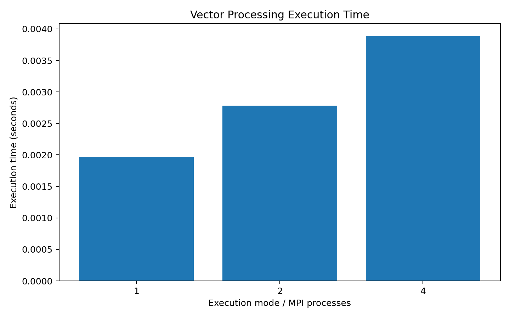
</p>

**Interpretation:** The measured sequential run has the lowest execution time. The 2-process and 4-process MPI runs take longer for this workload and environment.

### 2. Observed Speedup

<p align="center">
  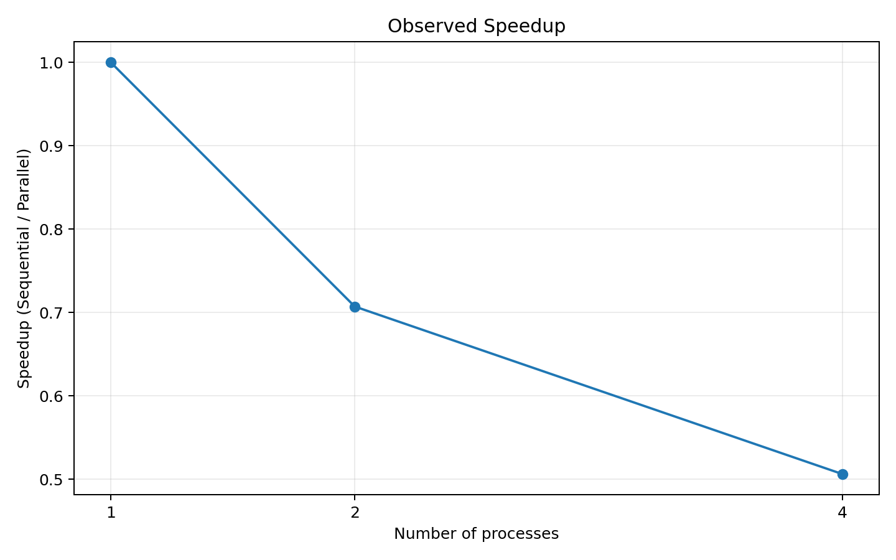
</p>

**Interpretation:** Both parallel configurations have speedup values below `1.0`, meaning the observed executions were slower than the sequential baseline.

### 3. Work Distribution

<p align="center">
  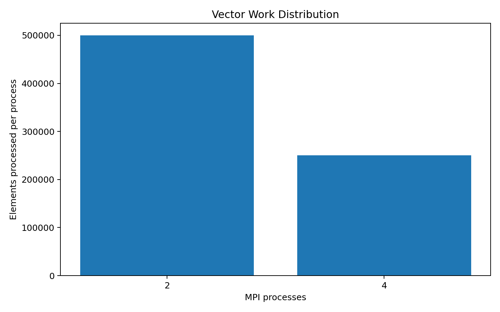
</p>

**Interpretation:** Increasing process count reduces the number of vector elements handled by each individual process.

---

## Important Execution Screenshots

The README intentionally places the most important evidence next to the sections where it is discussed. This makes it easy for a reviewer or instructor to verify the experiment without navigating through the repository manually.

### A. Sequential Baseline

This screenshot establishes the single-process baseline and shows the correct vector sum and timing information.

<p align="center">
  
</p>

### B. MPI with 2 Processes

This screenshot provides evidence of distributed execution with two MPI processes and the associated timing.

<p align="center">
  
</p>

### C. MPI with 3 Processes

This screenshot demonstrates that the same application can be executed with three MPI processes.

<p align="center">
  
</p>

### D. MPI with 4 Processes

This is the second primary performance configuration used in the documented comparison.

<p align="center">
  
</p>

### E. Performance Test Evidence

This screenshot records the performance-testing phase and supports the values discussed in the performance section.

<p align="center">
  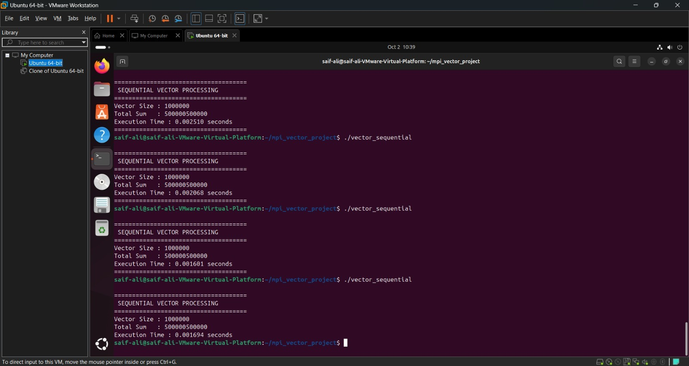
</p>

### F. Sequential vs Distributed Comparison

This screenshot visually demonstrates the comparison between sequential and distributed processing runs.

<p align="center">
  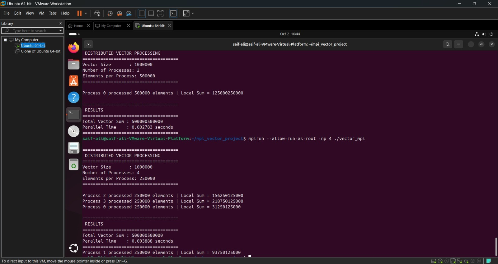
</p>

### G. Final MPI Results

This screenshot provides a consolidated view of MPI result verification.

<p align="center">
  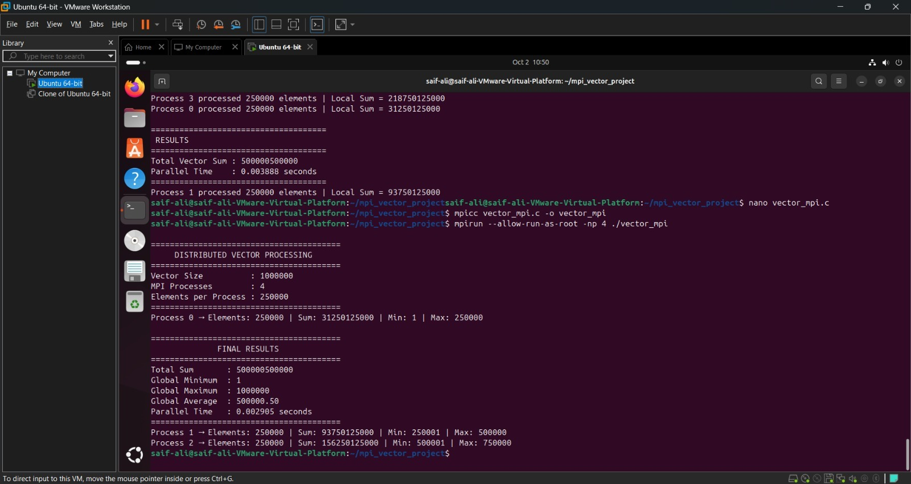
</p>

---

## Detailed Screenshot Evidence

The remaining screenshots are retained in the repository as experiment evidence and can be opened directly from GitHub.

| Screenshot | Purpose |
|---|---|
| `sequential_execution.jpeg` | Sequential execution and baseline result |
| `mpi_2_process.jpeg` | MPI execution with 2 processes |
| `mpi_3_processes.jpeg` | MPI execution with 3 processes |
| `mpi_4_processes.jpeg` | MPI execution with 4 processes |
| `performance_test.jpeg` | Performance-testing evidence |
| `sequential_vs_distributed_processing.jpeg` | Sequential/distributed comparison |
| `mpi_results.jpeg` | MPI result verification |
| `distributed_vector_1_processes.jpeg` | One-process vector distribution evidence |
| `distributed_vector_2_processes.jpeg` | Two-process workload distribution |
| `distributed_vector_4_processes.jpeg` | Four-process workload distribution |
| `parallel_time_1_process.jpeg` | One-process timing evidence |
| `parallel_time_2_process.jpeg` | Two-process timing evidence |
| `parallel_time_4_process.jpeg` | Four-process timing evidence |
| `comparing_sequential_&_parallel-time.jpeg` | Sequential and parallel timing comparison |
| `files_created.jpeg` | Project/output files created during the experiment |
| `nameless.jpeg` | Additional terminal/experiment evidence |

### Additional Evidence Gallery

<details>
<summary><b>Show additional distribution and timing screenshots</b></summary>

#### Distribution — 1 Process

<p align="center">
  
</p>

#### Distribution — 2 Processes

<p align="center">
  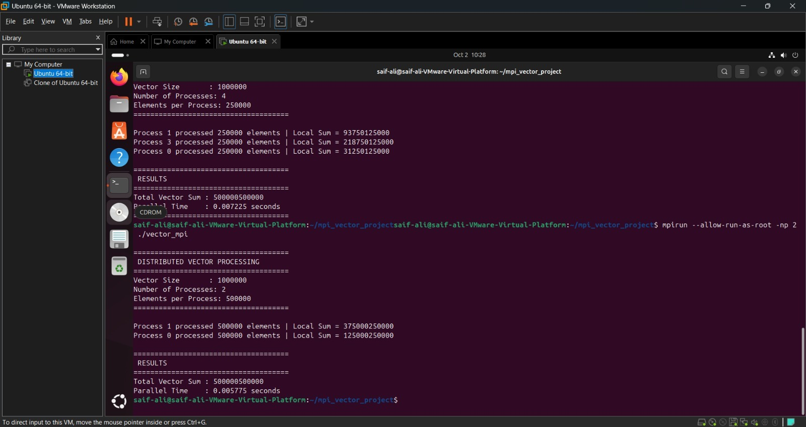
</p>

#### Distribution — 4 Processes

<p align="center">
  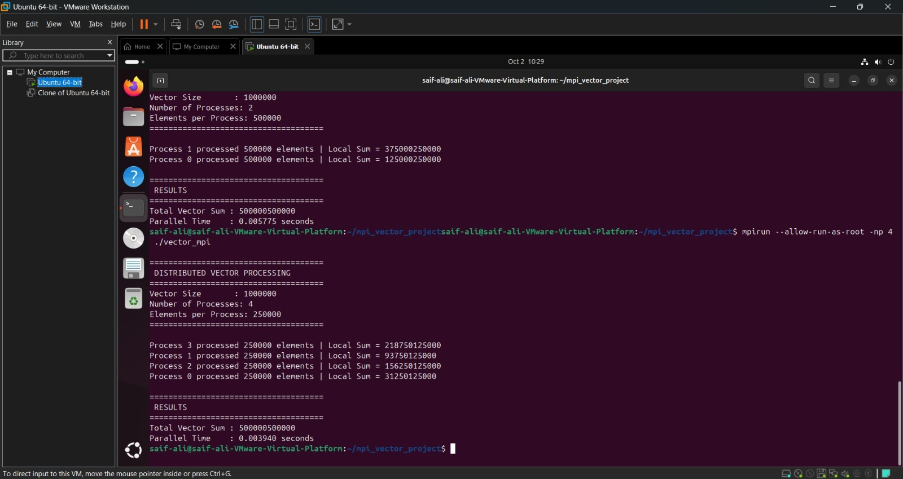
</p>

#### Parallel Timing — 1 Process

<p align="center">
  
</p>

#### Parallel Timing — 2 Processes

<p align="center">
  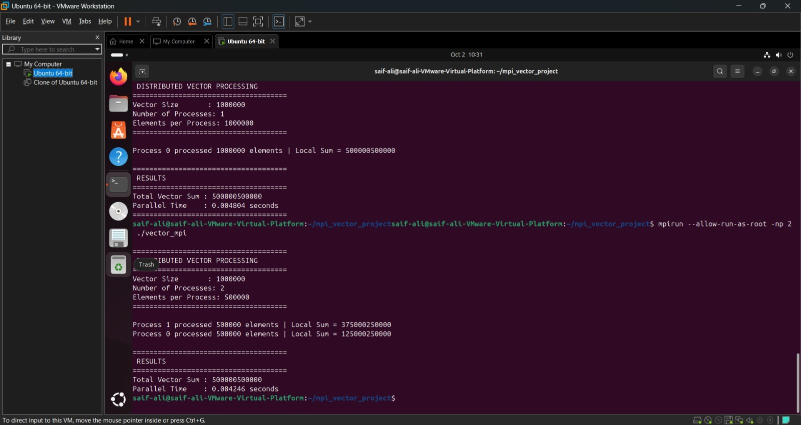
</p>

#### Parallel Timing — 4 Processes

<p align="center">
  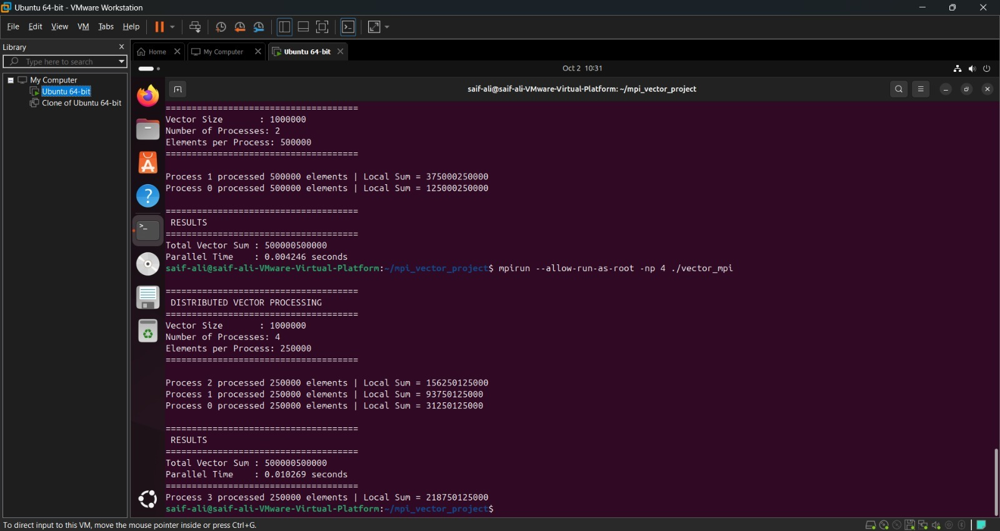
</p>

#### Sequential vs Parallel Timing

<p align="center">
  
</p>

#### Files Created

<p align="center">
  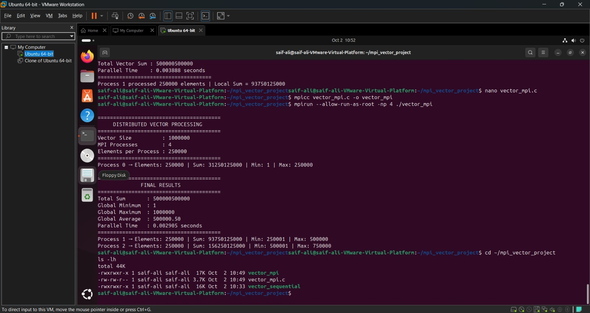
</p>

</details>

---

## Project Structure

The recommended final GitHub repository structure is:

```text
Distributed-Vector-Processing-MPI/
│
├── README.md
│
├── src/
│   ├── vector_mpi.c
│   └── vector_sequential.c
│
├── graphs/
│   ├── execution_time_comparison.png
│   ├── speedup.png
│   └── work_distribution.png
│
├── data/
│   └── performance_data.csv
│
└── screenshots/
    ├── sequential_execution.jpeg
    ├── mpi_2_process.jpeg
    ├── mpi_3_processes.jpeg
    ├── mpi_4_processes.jpeg
    ├── mpi_results.jpeg
    ├── performance_test.jpeg
    ├── sequential_vs_distributed_processing.jpeg
    ├── distributed_vector_1_processes.jpeg
    ├── distributed_vector_2_processes.jpeg
    ├── distributed_vector_4_processes.jpeg
    ├── parallel_time_1_process.jpeg
    ├── parallel_time_2_process.jpeg
    ├── parallel_time_4_process.jpeg
    ├── comparing_sequential_&_parallel-time.jpeg
    ├── files_created.jpeg
    └── nameless.jpeg
```

### Purpose of Each Directory

| Directory | Purpose |
|---|---|
| `src/` | C source code for sequential and MPI implementations |
| `graphs/` | Performance visualizations |
| `data/` | Structured performance measurements in CSV format |
| `screenshots/` | Terminal and experiment evidence |
| Root | Main project documentation |

---

## How to Build and Run

The following procedure is intended for a fresh Ubuntu 24.04 environment with Open MPI and GCC installed.

### 1. Clone the Repository

```bash
git clone https://github.com/<your-username>/Distributed-Vector-Processing-MPI.git
cd Distributed-Vector-Processing-MPI
```

Replace `<your-username>` with the GitHub account that owns the repository.

### 2. Enter the Source Directory

```bash
cd src
```

### 3. Verify GCC

```bash
gcc --version
```

### 4. Verify Open MPI

```bash
mpicc --version
mpirun --version
```

### 5. Compile the Sequential Program

```bash
gcc vector_sequential.c -o vector_sequential
```

Run it:

```bash
./vector_sequential
```

### 6. Compile the MPI Program

```bash
mpicc vector_mpi.c -o vector_mpi
```

### 7. Run with 2 MPI Processes

For a normal non-root user:

```bash
mpirun -np 2 ./vector_mpi
```

If the Ubuntu environment is running MPI as `root`, Open MPI may require:

```bash
mpirun --allow-run-as-root -np 2 ./vector_mpi
```

### 8. Run with 3 MPI Processes

```bash
mpirun --allow-run-as-root -np 3 ./vector_mpi
```

### 9. Run with 4 MPI Processes

```bash
mpirun --allow-run-as-root -np 4 ./vector_mpi
```

> If MPI reports that the requested process count exceeds the available slots, use an appropriate VM CPU allocation or, only when appropriate for the environment, run with the MPI configuration option that permits oversubscription.

---

## Reproducibility Procedure

To reproduce the reported experiment more reliably, follow the same procedure for every configuration.

### Step 1 — Use the same vector size

Keep the input fixed at:

```text
N = 1,000,000
```

### Step 2 — Run the sequential version several times

The documented experiment used four sequential timing runs.

Record each timing and calculate the arithmetic mean.

### Step 3 — Run the MPI program with the selected process counts

At minimum:

```text
2 processes
4 processes
```

The repository also contains evidence for 3 processes.

### Step 4 — Keep the execution environment consistent

Do not change the following between comparisons:

- VM CPU allocation
- VM memory allocation
- operating system
- compiler / MPI implementation
- vector size
- program source code
- optimization settings
- background workload, as far as practical

### Step 5 — Repeat measurements

A more reliable benchmark should run each configuration multiple times instead of relying on one timing observation.

### Step 6 — Calculate statistics

For every configuration, report at least:

- minimum time,
- maximum time,
- average time,
- speedup,
- parallel efficiency.

This reduces the effect of temporary system load and scheduling variation.

---

## Results Interpretation

### What the experiment proves

The experiment successfully proves that MPI can:

- launch multiple processes,
- identify process ranks,
- distribute a workload,
- execute local computation independently,
- combine partial results, and
- produce the same final result as the sequential implementation.

### What the experiment does not prove

The current measurements do **not** prove that:

- 4 processes are always faster than 2 processes,
- MPI is always faster than sequential execution, or
- adding more processes always improves scalability.

Those conclusions would require significantly larger workloads and a wider range of carefully controlled benchmarks.

### Main observation

The strongest result from this experiment is actually the relationship between **workload size and parallelization overhead**.

For a simple sum over one million elements, the computation is too lightweight for the tested MPI configurations to overcome their coordination costs inside the current VM environment.

---

## Limitations

This experiment has several limitations that should be acknowledged in an academic report or viva:

1. **Small workload relative to MPI overhead** — one million integer additions are completed very quickly.
2. **Virtualized environment** — VMware can introduce additional execution and scheduling overhead.
3. **Limited process counts** — only a small number of process configurations were benchmarked.
4. **Single-machine execution** — the current experiment demonstrates process-level MPI execution on one VM rather than a multi-node cluster.
5. **Limited repetition for parallel timings** — the documented parallel values represent the supplied test measurements and are not a large statistical benchmark.
6. **Potential system noise** — CPU scheduling, background applications and VM resource contention can affect very small timings.

---

## Future Improvements

The project can be extended into a stronger parallel-computing benchmark by adding:

### 1. Larger datasets

Test:

```text
1,000,000
10,000,000
50,000,000
100,000,000+
```

A larger workload increases the amount of useful computation relative to fixed MPI overhead.

### 2. More process configurations

Compare:

```text
1, 2, 4, 8, 16, ...
```

subject to available CPU resources.

### 3. Repeated benchmarking

Run each configuration 10–30 times and report mean and standard deviation.

### 4. Automatic performance analysis

Extend the program or a Python analysis script to automatically generate:

- execution-time plots,
- speedup plots,
- efficiency plots,
- scalability curves,
- workload-distribution charts.

### 5. More vector operations

The same MPI framework can be extended to calculate:

- sum,
- minimum,
- maximum,
- average,
- dot product,
- element-wise transformations.

### 6. Multi-machine MPI

The strongest extension would be to execute MPI processes across two or more physical computers connected over a network. This would demonstrate the distributed-memory model more directly.

### 7. Communication analysis

Measure separately:

```text
Computation time
Data distribution time
Reduction time
Total execution time
```

This would make the impact of MPI overhead visible rather than treating it as one combined number.

---

## Learning Outcomes

By completing this project, a student should be able to explain:

- what MPI is and why it is used,
- the role of an MPI rank,
- the difference between a process and a thread,
- how `MPI_Comm_size()` and `MPI_Comm_rank()` work,
- how collective communication differs from ordinary function calls,
- how `MPI_Scatter()` distributes data,
- how `MPI_Reduce()` aggregates data,
- why communication and synchronization have performance costs,
- how speedup is calculated,
- how parallel efficiency is calculated, and
- why real-world parallel systems require workload sizes large enough to amortize overhead.

---

## Conclusion

This project demonstrates a complete MPI-based distributed vector-processing workflow in C.

A vector containing **1,000,000 elements** is processed first sequentially and then through multiple MPI processes. The MPI implementation distributes the vector using `MPI_Scatter()`, performs independent local computation, and combines the partial results using `MPI_Reduce()`.

The most important correctness result is:

```text
Expected / Sequential / MPI Result
==================================
500000500000
```

The documented performance measurements are:

```text
Sequential average : 0.001968 s
2 MPI processes    : 0.002783 s
4 MPI processes    : 0.003888 s
```

The measured speedups are approximately:

```text
2 processes → 0.707×
4 processes → 0.506×
```

Although the MPI configurations were slower for this particular workload, that outcome is valuable rather than a failure. It demonstrates a fundamental concept in parallel computing: **parallel execution introduces overhead, and useful speedup occurs only when the amount of parallelizable computation is large enough to justify that overhead.**

The project therefore covers both sides of parallel computing:

> **How to distribute work** and **how to critically evaluate whether the distribution actually improves performance**.

---

## Academic / Viva Summary

A concise explanation for demonstration or viva:

> “Our project implements distributed vector processing using MPI in C. We create a vector of one million elements, divide the vector among multiple MPI processes using `MPI_Scatter`, calculate a local sum independently in each process, and combine the local sums using `MPI_Reduce`. We compare the MPI implementation with a sequential version and measure execution time for different process counts. In our VMware environment, the sequential average was 0.001968 seconds, while the 2-process and 4-process MPI executions took 0.002783 and 0.003888 seconds respectively. The MPI versions were slower because the workload is relatively small and MPI introduces communication, synchronization, process-management, and virtualization overhead. The project therefore demonstrates both MPI-based workload distribution and the practical importance of overhead-aware performance analysis.”

---

## Author / Team

**Project:** Distributed Vector Processing using MPI  
**Language:** C  
**Parallel Framework:** MPI  
**MPI Implementation:** Open MPI  
**Platform:** Ubuntu 24.04 / VMware Workstation  
**Repository:** GitHub

---

<p align="center">
  <b>Distributed Vector Processing using MPI</b><br>
  Parallel Computing • MPI • C • Performance Analysis
</p>
