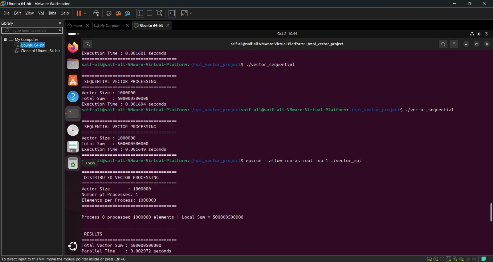

# Parallel Vector Processing using OpenMP

<p align="center">
  
  
  
  
</p>

<p align="center">
  <b>Parallel vector processing in C using OpenMP with correctness verification and performance analysis.</b>
</p>

---

## Table of Contents

- [Project Overview](#project-overview)
- [Problem Statement](#problem-statement)
- [Objectives](#objectives)
- [Key Concepts](#key-concepts)
- [Technology Stack](#technology-stack)
- [OpenMP Overview](#openmp-overview)
- [System Architecture](#system-architecture)
- [Processing Methodology](#processing-methodology)
- [Program Flow](#program-flow)
- [Sequential Baseline](#sequential-baseline)
- [OpenMP Implementation](#openmp-implementation)
- [Experimental Setup](#experimental-setup)
- [Performance Results](#performance-results)
- [Speedup and Parallel Efficiency](#speedup-and-parallel-efficiency)
- [Why More Threads Were Slower](#why-more-threads-were-slower)
- [Work Distribution](#work-distribution)
- [Performance Graphs](#performance-graphs)
- [Execution Screenshots](#execution-screenshots)
- [Project Structure](#project-structure)
- [How to Build and Run](#how-to-build-and-run)
- [Reproducibility](#reproducibility)
- [Results Interpretation](#results-interpretation)
- [Limitations](#limitations)
- [Future Improvements](#future-improvements)
- [Learning Outcomes](#learning-outcomes)
- [Viva Summary](#viva-summary)
- [Conclusion](#conclusion)

---

## Project Overview

**Parallel Vector Processing using OpenMP** is a parallel-computing project implemented in **C using OpenMP**.

The project processes a large vector and compares a sequential implementation with a parallel OpenMP implementation using multiple threads. The vector-processing workload is divided among threads, the computation is performed concurrently, and the partial results are combined into a final sum.

The experiment demonstrates an important principle of parallel computing:

> **Increasing the number of threads does not automatically make a program faster.**

For the documented workload, the sequential implementation is faster than the tested 2-thread and 4-thread OpenMP executions. This result is useful because it shows the effect of parallelization overhead on a lightweight computation.

---

## Problem Statement

Processing a large vector sequentially requires a single execution stream to perform the complete calculation. The objective of this project is to investigate how the same workload behaves when the computation is parallelized using OpenMP threads.

### Problem Definition

> **Design and implement a vector-processing application using OpenMP in C, where a large vector is processed in parallel by multiple threads, the partial results are combined into a final sum, and the performance is compared with a sequential implementation.**

---

## Objectives

1. Understand the OpenMP shared-memory programming model.
2. Create and execute parallel regions using OpenMP.
3. Divide vector-processing work among multiple threads.
4. Perform vector computation concurrently.
5. Combine partial results using an OpenMP reduction operation.
6. Verify that sequential and parallel executions produce the same result.
7. Measure execution time for different thread counts.
8. Calculate speedup and parallel efficiency.
9. Analyze the effect of thread and synchronization overhead.
10. Understand why more threads do not automatically guarantee better performance.

---

## Key Concepts

| Concept | Demonstration in This Project |
|---|---|
| Parallel programming | OpenMP-based execution in C |
| Threads | Multiple OpenMP threads process the workload |
| Shared memory | Threads operate within the same address space |
| Work sharing | Vector loop iterations are divided among threads |
| Parallel loop | Multiple iterations are executed concurrently |
| Reduction | Partial sums are safely combined |
| Correctness verification | Sequential and parallel results are compared |
| Performance measurement | Execution times are recorded |
| Scalability | Different thread counts are compared |
| Parallel efficiency | Speedup is related to thread count |

---

## Technology Stack

| Component | Technology / Version |
|---|---|
| Programming Language | C |
| Parallel Programming Model | OpenMP |
| Compiler | GCC 13.3.0 |
| Operating System | Ubuntu 24.04 |
| Execution Environment | VMware Workstation |
| OpenMP Compiler Flag | `-fopenmp` |
| Repository | GitHub |

---

## OpenMP Overview

OpenMP is a **shared-memory parallel programming model** that allows a C/C++ program to execute selected parts of its workload using multiple threads.

In this project:

- One application runs with multiple OpenMP threads.
- Threads share the same memory.
- The vector-processing loop is divided among the threads.
- Each thread processes its assigned iterations.
- A reduction operation combines the partial sums.
- The number of threads can be controlled through `OMP_NUM_THREADS`.

The project follows this basic pattern:

```text
Threads
   ↓
Work Sharing
   ↓
Parallel Computation
   ↓
Reduction
   ↓
Final Result
```

---

## System Architecture

```text
                         LARGE VECTOR
                              |
                              v
                    +----------------------+
                    |   OpenMP Parallel    |
                    |        Region        |
                    +----------+-----------+
                               |
                +--------------+--------------+
                |              |              |
                v              v              v
          +-----------+  +-----------+  +-----------+
          | Thread 0  |  | Thread 1  |  | Thread 2  | ... Thread N
          | Vector    |  | Vector    |  | Vector    |
          | Iterations|  | Iterations|  | Iterations|
          | Partial   |  | Partial   |  | Partial   |
          | Sum       |  | Sum       |  | Sum       |
          +-----+-----+  +-----+-----+  +-----+-----+
                \              |              /
                 \             |             /
                  +------------+-------------+
                               |
                           Reduction
                               |
                               v
                         +-----------+
                         | Final Sum |
                         +-----------+
```

The system has two main stages:

**Stage 1 — Parallel Computation:** OpenMP divides the vector-processing iterations among threads.

**Stage 2 — Reduction:** the partial sums are combined safely to produce the final result.

---

## Processing Methodology

The documented experiment uses:

```text
Vector size = 1,000,000 elements
```

The input vector contains the values from `1` through `1,000,000`.

The expected sum is:

```text
1 + 2 + 3 + ... + 1,000,000 = 500000500000
```

This known value provides a simple and reliable correctness check.

### Sequential Approach

```text
Vector
  |
  v
Single execution stream
  |
  v
Process all 1,000,000 elements
  |
  v
Final Sum
```

### OpenMP Approach

```text
1,000,000 elements
        |
        +-----------------------------+
        |                             |
   2 threads                     4 threads
        |                             |
  ~500,000 each                 ~250,000 each
        |                             |
  Parallel computation        Parallel computation
        |                             |
        +--------------+--------------+
                       |
                   Reduction
                       |
                       v
                   Final Sum
```

The exact loop-iteration assignment is handled by OpenMP's work-sharing mechanism.

---

## Program Flow

The OpenMP implementation follows this sequence:

1. Prepare the vector containing `1,000,000` elements.
2. Start the execution timer.
3. Create the OpenMP parallel region.
4. Divide the vector-processing loop among the available threads.
5. Compute partial sums concurrently.
6. Combine the partial sums using reduction.
7. Stop the timer.
8. Verify the final result.
9. Repeat the experiment using different thread counts.
10. Compare the sequential and parallel execution times.

---

## Sequential Baseline

The sequential program processes all **1,000,000 elements** without parallelization.

### Measured Runs

| Run | Execution Time (s) |
|---:|---:|
| 1 | 0.002510 |
| 2 | 0.002068 |
| 3 | 0.001601 |
| 4 | 0.001694 |
| **Average** | **0.001968** |

### Correctness Output

```text
Vector Size : 1000000
Total Sum   : 500000500000
```

### Sequential Execution Screenshot

<p align="center">
  
</p>

*Figure 1 — Sequential execution and baseline result.*

---

## OpenMP Implementation

### 2-Thread Execution

For the 2-thread configuration:

```text
Vector Size          : 1000000
Number of Threads    : 2
Elements per Thread  : ~500000
Total Vector Sum     : 500000500000
Parallel Time        : 0.002783 seconds
```

<p align="center">
  
</p>

*Figure 2 — OpenMP execution using 2 threads.*

> The repository may still contain the original filename `mpi_2_process.jpeg`. The execution represented here should be the OpenMP version.

### 3-Thread Execution

The project also includes evidence for execution using 3 threads.

<p align="center">
  
</p>

*Figure 3 — OpenMP execution using 3 threads.*

### 4-Thread Execution

For the 4-thread configuration:

```text
Vector Size          : 1000000
Number of Threads    : 4
Elements per Thread  : ~250000
Total Vector Sum     : 500000500000
Parallel Time        : 0.003888 seconds
```

<p align="center">
  
</p>

*Figure 4 — OpenMP execution using 4 threads.*

---

## Experimental Setup

| Parameter | Configuration |
|---|---|
| Operating System | Ubuntu 24.04 |
| Execution Environment | VMware Workstation |
| Compiler | GCC 13.3.0 |
| Programming Language | C |
| Parallel Model | OpenMP |
| Dataset Size | 1,000,000 elements |
| Sequential Configuration | 1 execution stream |
| Parallel Configurations | 2, 3 and 4 threads |
| Primary Operation | Vector sum |
| Expected Result | `500000500000` |

> **Experimental note:** The recorded timings are observations from the specified Ubuntu/VMware environment. They are not universal benchmark values. CPU resources, compiler settings, system load, VM configuration, memory behavior, and other factors can change the measured times.

---

## Performance Results

### Recorded Execution Times

| Configuration | Threads | Approx. Work / Thread | Execution Time (s) |
|---|---:|---:|---:|
| Sequential | 1 | 1,000,000 | **0.001968** average |
| OpenMP | 2 | 500,000 | **0.002783** |
| OpenMP | 4 | 250,000 | **0.003888** |

### Performance Observation

```text
Sequential : 0.001968 s
2 threads  : 0.002783 s
4 threads  : 0.003888 s
```

For this particular workload, the sequential implementation is the fastest of the measured configurations.

This does **not** mean OpenMP is ineffective. It demonstrates that the workload is lightweight enough that the overhead of parallel execution is greater than the time saved by dividing the work.

---

## Speedup and Parallel Efficiency

### Speedup Formula

```text
Speedup = Sequential Time / Parallel Time
```

### 2-Thread Speedup

```text
Sequential average = 0.001968 s
2-thread time      = 0.002783 s

Speedup = 0.001968 / 0.002783
        ≈ 0.707×
```

### 4-Thread Speedup

```text
Sequential average = 0.001968 s
4-thread time      = 0.003888 s

Speedup = 0.001968 / 0.003888
        ≈ 0.506×
```

### Parallel Efficiency

```text
Parallel Efficiency = Speedup / Number of Threads × 100
```

| Configuration | Speedup | Parallel Efficiency |
|---|---:|---:|
| 2 threads | 0.707× | **35.36%** |
| 4 threads | 0.506× | **12.65%** |

A speedup below `1.0×` means that the measured parallel execution took longer than the sequential baseline.

---

## Why More Threads Were Slower

A common assumption is:

```text
More Threads
     ↓
Less Work per Thread
     ↓
Lower Execution Time
```

In practice, parallel execution also has overhead:

```text
Parallel Execution Time
        =
Useful Computation
+
Thread Runtime Overhead
+
Work Scheduling
+
Synchronization
+
Reduction
+
Memory / Cache Effects
+
Virtualization / System Overhead
```

For one million simple additions, the actual computation is very lightweight. Therefore, the cost of managing multiple threads can outweigh the benefit of parallel execution.

### Main Reasons

**1. Lightweight computation**

The vector operation is a simple sum, so the amount of computation per element is very small.

**2. Thread management overhead**

OpenMP must create and manage the worker threads and the parallel region.

**3. Scheduling and synchronization**

Threads must coordinate before the final result is completed.

**4. Reduction overhead**

The partial sums must be combined safely.

**5. Virtual machine overhead**

The experiment runs inside VMware, where resource allocation and scheduling can affect very short executions.

**6. Memory and cache behavior**

Sequential execution can be extremely efficient for a simple contiguous traversal, while parallel execution introduces additional coordination and runtime activity.

### Main Lesson

> **Parallelism does not automatically mean speedup.**

A workload needs enough computation to justify the overhead introduced by parallel execution.

---

## Work Distribution

For a vector containing 1,000,000 elements:

| Number of Threads | Approx. Elements / Thread |
|---:|---:|
| 1 | 1,000,000 |
| 2 | 500,000 |
| 4 | 250,000 |

Conceptually:

```text
1 Thread:
[------------------------------------------------------------]
                     1,000,000 elements

2 Threads:
[------------------------------][------------------------------]
          ~500,000                      ~500,000

4 Threads:
[---------------][---------------][---------------][---------------]
   ~250,000          ~250,000          ~250,000          ~250,000
```

The amount of arithmetic handled by each thread decreases as the thread count increases. However, the total program still includes the cost of creating, scheduling, synchronizing, and reducing the parallel work.

---

## Performance Graphs

The original project includes three performance graphs. They are retained here and interpreted using OpenMP terminology.

### 1. Sequential vs OpenMP Execution Time

<p align="center">
  
</p>

**Interpretation:** The sequential implementation has the lowest measured execution time, while the 2-thread and 4-thread OpenMP configurations take longer for this workload.

### 2. Observed Speedup

<p align="center">
  
</p>

**Interpretation:** Both measured OpenMP configurations have speedup values below `1.0×`, indicating that they were slower than the sequential baseline.

### 3. Work Distribution

<p align="center">
  
</p>

**Interpretation:** Increasing the thread count reduces the approximate number of vector elements handled by each individual thread.

---

## Execution Screenshots

All screenshots from the original project are retained below so the README contains the complete experimental evidence.

### 1. Sequential Execution

<p align="center">
  
</p>

### 2. OpenMP — 2 Threads

<p align="center">
  
</p>

### 3. OpenMP — 3 Threads

<p align="center">
  
</p>

### 4. OpenMP — 4 Threads

<p align="center">
  
</p>

### 5. Performance Test

<p align="center">
  
</p>

### 6. Sequential vs OpenMP Processing

<p align="center">
  
</p>

### 7. OpenMP Results

<p align="center">
  
</p>

### 8. Vector Distribution — 1 Thread

<p align="center">
  
</p>

### 9. Vector Distribution — 2 Threads

<p align="center">
  
</p>

### 10. Vector Distribution — 4 Threads

<p align="center">
  
</p>

### 11. Parallel Time — 1 Thread

<p align="center">
  
</p>

### 12. Parallel Time — 2 Threads

<p align="center">
  
</p>

### 13. Parallel Time — 4 Threads

<p align="center">
  
</p>

### 14. Sequential vs Parallel Timing

<p align="center">
  
</p>

### 15. Files Created During the Experiment

<p align="center">
  
</p>

### 16. Additional Terminal Evidence

<p align="center">
  
</p>

### Screenshot Reference Table

| Screenshot | Purpose |
|---|---|
| `sequential_execution.jpeg` | Sequential execution and baseline |
| `mpi_2_process.jpeg` | OpenMP execution with 2 threads |
| `mpi_3_processes.jpeg` | OpenMP execution with 3 threads |
| `mpi_4_processes.jpeg` | OpenMP execution with 4 threads |
| `performance_test.jpeg` | Performance-testing evidence |
| `sequential_vs_distributed_processing.jpeg` | Sequential vs OpenMP comparison |
| `mpi_results.jpeg` | Final result verification |
| `distributed_vector_1_processes.jpeg` | Work distribution with 1 thread |
| `distributed_vector_2_processes.jpeg` | Work distribution with 2 threads |
| `distributed_vector_4_processes.jpeg` | Work distribution with 4 threads |
| `parallel_time_1_process.jpeg` | Timing evidence with 1 thread |
| `parallel_time_2_process.jpeg` | Timing evidence with 2 threads |
| `parallel_time_4_process.jpeg` | Timing evidence with 4 threads |
| `comparing_sequential_&_parallel-time.jpeg` | Sequential vs parallel timing |
| `files_created.jpeg` | Project files and experiment setup |
| `nameless.jpeg` | Additional terminal evidence |

> The existing filenames above are retained from the original repository so that the README can reference the supplied screenshots directly. The **project terminology and interpretation are OpenMP/threads**, not MPI/processes.

---

## Project Structure

A clean final repository structure is:

```text
Parallel-Vector-Processing-OpenMP/
│
├── README.md
│
├── src/
│   ├── vector_openmp.c
│   └── vector_sequential.c
│
├── graphs/
│   ├── execution_time_comparison.png
│   ├── speedup.png
│   └── work_distribution.png
│
├── data/
│   └── performance_data.csv
│
└── screenshots/
    ├── sequential_execution.jpeg
    ├── mpi_2_process.jpeg
    ├── mpi_3_processes.jpeg
    ├── mpi_4_processes.jpeg
    ├── performance_test.jpeg
    ├── sequential_vs_distributed_processing.jpeg
    ├── mpi_results.jpeg
    ├── distributed_vector_1_processes.jpeg
    ├── distributed_vector_2_processes.jpeg
    ├── distributed_vector_4_processes.jpeg
    ├── parallel_time_1_process.jpeg
    ├── parallel_time_2_process.jpeg
    ├── parallel_time_4_process.jpeg
    ├── comparing_sequential_&_parallel-time.jpeg
    ├── files_created.jpeg
    └── nameless.jpeg
```

### Directory Purpose

| Directory | Purpose |
|---|---|
| `src/` | C source code |
| `graphs/` | Performance graphs |
| `data/` | Performance measurements |
| `screenshots/` | Execution and experiment evidence |
| Root | Main project documentation |

---

## How to Build and Run

The following procedure is intended for Ubuntu 24.04 with GCC and OpenMP support installed.

### 1. Clone the Repository

```bash
git clone https://github.com/<your-username>/Parallel-Vector-Processing-OpenMP.git
cd Parallel-Vector-Processing-OpenMP
```

Replace `<your-username>` with the GitHub account that owns the repository.

### 2. Enter the Source Directory

```bash
cd src
```

### 3. Verify GCC

```bash
gcc --version
```

### 4. Compile the Sequential Program

```bash
gcc vector_sequential.c -o vector_sequential
```

Run it:

```bash
./vector_sequential
```

### 5. Compile the OpenMP Program

OpenMP support is enabled with the `-fopenmp` compiler flag:

```bash
gcc -fopenmp vector_openmp.c -o vector_openmp
```

### 6. Run with 2 Threads

```bash
OMP_NUM_THREADS=2 ./vector_openmp
```

### 7. Run with 3 Threads

```bash
OMP_NUM_THREADS=3 ./vector_openmp
```

### 8. Run with 4 Threads

```bash
OMP_NUM_THREADS=4 ./vector_openmp
```

---

## Reproducibility

To reproduce the documented experiment:

### Step 1 — Keep the input fixed

```text
N = 1,000,000
```

### Step 2 — Run the sequential version several times

Record the execution time for each run and calculate the average.

### Step 3 — Run the OpenMP version

Test:

```text
1 thread
2 threads
3 threads
4 threads
```

### Step 4 — Keep the environment consistent

Keep the following unchanged during comparison:

- VM CPU allocation
- VM memory allocation
- operating system
- compiler
- source code
- vector size
- compiler flags
- background workload, as far as practical

### Step 5 — Repeat measurements

Running every configuration multiple times gives more reliable performance results.

### Step 6 — Record statistics

For every configuration, report:

- minimum time
- maximum time
- average time
- speedup
- parallel efficiency

---

## Results Interpretation

### What the Experiment Demonstrates

The experiment demonstrates that OpenMP can:

- create multiple threads,
- divide loop iterations among threads,
- perform computations concurrently,
- combine partial results using reduction,
- produce the same final result as the sequential implementation, and
- provide measurable performance data.

### What the Current Measurements Do Not Prove

The current measurements do **not** prove that:

- 4 threads are always faster than 2 threads,
- OpenMP is always faster than sequential execution, or
- increasing the thread count always improves scalability.

Those conclusions require larger workloads and more controlled benchmarking.

### Main Observation

For a simple sum over one million elements, the computational work is very small. In the current environment, the overhead associated with parallel execution outweighs the performance benefit of using additional threads.

---

## Limitations

1. **Small workload** — one million simple additions execute very quickly.
2. **Virtualized environment** — VMware may introduce additional scheduling overhead.
3. **Limited thread counts** — only a small number of configurations were tested.
4. **Simple computation** — vector summation has low computational intensity.
5. **Limited statistical repetition** — the documented measurements are based on the supplied experimental runs.
6. **System noise** — background applications and CPU scheduling can affect very small timings.

---

## Future Improvements

### 1. Test Larger Datasets

```text
1,000,000
10,000,000
50,000,000
100,000,000+
```

Larger workloads make the useful computation more significant relative to parallel overhead.

### 2. Test More Thread Counts

```text
1, 2, 4, 8, 16, ...
```

The practical limit depends on the CPU resources available to the system or VM.

### 3. Repeat the Benchmark

Run each configuration multiple times and report the mean and standard deviation.

### 4. Automate Performance Analysis

Automatically generate:

- execution-time graphs,
- speedup graphs,
- efficiency graphs,
- scalability curves, and
- workload-distribution charts.

### 5. Add More Vector Operations

The same OpenMP framework can be extended to:

- sum,
- minimum,
- maximum,
- average,
- dot product,
- element-wise transformations.

### 6. Analyze Parallel Overhead Separately

Measure:

```text
Serial setup time
Parallel computation time
Synchronization / reduction overhead
Total execution time
```

This makes it easier to identify where the parallel execution time is being spent.

---

## Learning Outcomes

After completing this project, a student should be able to explain:

- what OpenMP is and why it is used,
- the difference between a process and a thread,
- the shared-memory programming model,
- how an OpenMP parallel region works,
- how a parallel loop divides iterations,
- how reduction combines partial results,
- why synchronization has a performance cost,
- how execution time is measured,
- how speedup is calculated,
- how parallel efficiency is calculated, and
- why workload size is important for achieving useful parallel performance.

---

## Viva Summary

> **“Our project implements parallel vector processing using OpenMP in C. We create a vector containing one million elements and first calculate its sum sequentially. We then use OpenMP to divide the vector-processing loop among multiple threads and combine the partial sums using a reduction operation. We compare the sequential execution with different OpenMP thread configurations. In our documented VMware environment, the sequential average was 0.001968 seconds, while the 2-thread and 4-thread executions took 0.002783 and 0.003888 seconds respectively. The OpenMP versions were slower because the computation is very simple and small, while thread management, scheduling, synchronization, reduction, and virtualization introduce overhead. The main lesson is that parallelism does not automatically produce speedup; the workload must be large enough to justify the overhead of parallel execution.”**

---

## Conclusion

This project demonstrates a complete **OpenMP-based parallel vector-processing workflow in C**.

A vector containing **1,000,000 elements** is processed sequentially and then using multiple OpenMP threads. The parallel implementation divides the loop workload among threads, performs the computation concurrently, and combines the partial results into a single final sum.

The correctness result is:

```text
Expected / Sequential / OpenMP Result
=====================================
500000500000
```

The documented performance measurements are:

```text
Sequential average : 0.001968 s
2 OpenMP threads   : 0.002783 s
4 OpenMP threads   : 0.003888 s
```

The measured speedups are:

```text
2 threads → 0.707×
4 threads → 0.506×
```

Although the OpenMP executions were slower for this particular workload, this result is valuable because it demonstrates a fundamental principle of parallel computing:

> **Parallel execution introduces overhead, and useful speedup occurs only when the amount of parallelizable computation is large enough to justify that overhead.**

The project therefore demonstrates both **how to parallelize a workload using OpenMP** and **how to evaluate whether parallelization actually improves performance**.

---

<p align="center">
  <b>Parallel Vector Processing using OpenMP</b><br>
  Parallel Computing • OpenMP • C • Performance Analysis
</p>
